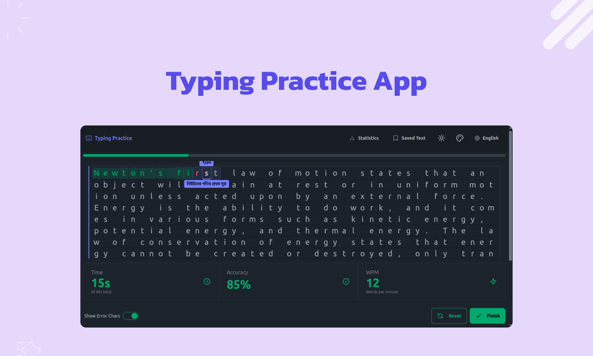
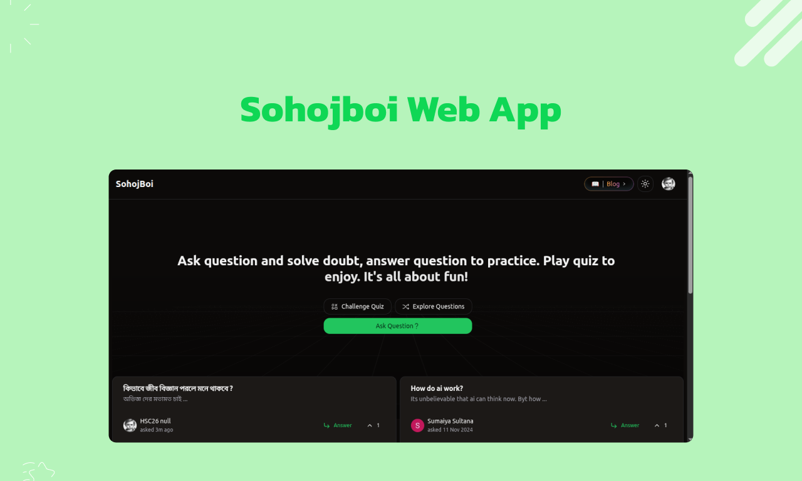
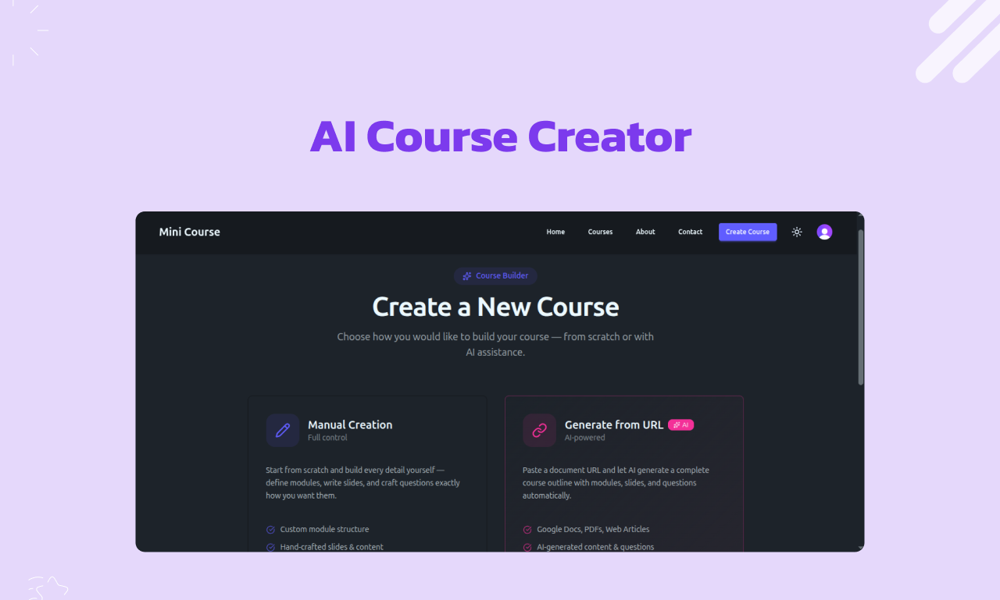
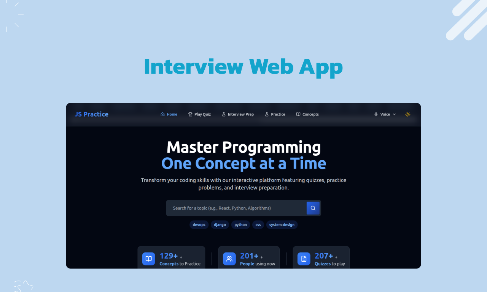
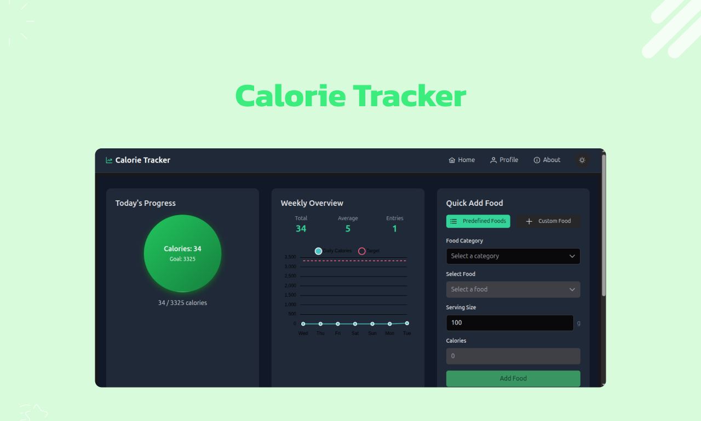

<h1 align="center">Ashfiquzzaman Sajal</h1>
<h3 align="center">Remote Software Engineer · Frontend & AI-Web Apps</h3>

  
  
  
  

---

  <b>I build production-ready web products — from pixel-perfect landing pages to full AI-powered applications — using React & Next.js.</b> 
  Open to collaborating with teams building ambitious products.

### 👋 Who I Am
I'm a **remote software engineer** who turns ideas into shipped products. My sweet spot is the **React + Next.js** stack: I can take a startup from a blank repo to a live, conversion-focused landing page, then extend it into a real application with authentication, payments, databases, and **AI features** baked in.

Founders hire me to move fast without sacrificing code quality. HR teams like me because I communicate clearly, work asynchronously across time zones, and own features end-to-end.

### 🚀 What I Can Build For You
- **Landing pages & marketing sites** — fast, SEO-optimized, responsive, conversion-focused (Next.js, Tailwind).
- **SaaS & web apps** — dashboards, auth, API routes, database integration, payments (Stripe).
- **AI-powered apps** — chat interfaces, RAG, LLM integrations, AI dashboards built on the modern AI stack.
- **Design → code** — Figma to clean, reusable React components.
- **Full deployment** — Vercel/CI/CD, performance tuning, Core Web Vitals.

### 🧰 Core Stack

**Frontend**

  
  
  
  
  

**Backend & APIs**

  
  
  

**AI**

  
  
  
  

**Data**

  
  
  
  

**Tooling & Languages**

  
  
  
  

### 💡 Why Work With Me
- ✅ **End-to-end ownership** — from wireframe to production, not just tickets.
- ✅ **Remote-first** — async communication, reliable, self-managed.
- ✅ **AI-native** — I ship AI features, not just talk about them.
- ✅ **Fast & pragmatic** — startup speed with maintainable code.
- ✅ **Clear communicator** — founders and HR get regular, readable updates.

### 📈 GitHub Activity

  

  
  

  

### 🖼️ Featured Projects
A selection of web apps I've built with React & Next.js — from utility tools to course platforms.

| Project | Preview |
|---------|---------|
| **Typing App** — improve typing speed & accuracy |  |
| **Sohojboi** — content/reading web app |  |
| **Mini Course** — online course platform |  |
| **JS Practice App** — interactive JavaScript practice |  |
| **Calorie Tracker** — track nutrition & daily intake |  |

### 📫 Let's Connect
Always happy to explore how I can help bring product ideas to life.

- 📧 **ashsajal@yahoo.com**
- 💼 [LinkedIn](https://linkedin.com/in/ashsajal)
- 🐦 [Twitter / X](https://twitter.com/ashsajal1)
- ✍️ [Dev Community](https://dev.to/ashsajal)
- 💻 [LeetCode](https://www.leetcode.com/ashsajal1)

<i>Flexible for remote, contract, and project-based engagements. Let's build something people use.</i>

